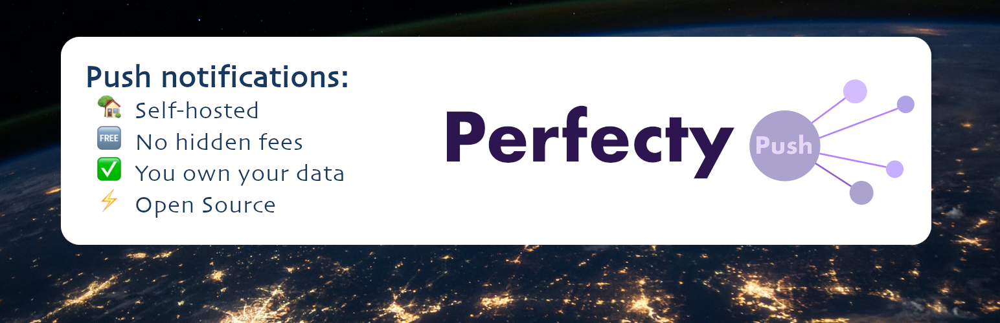
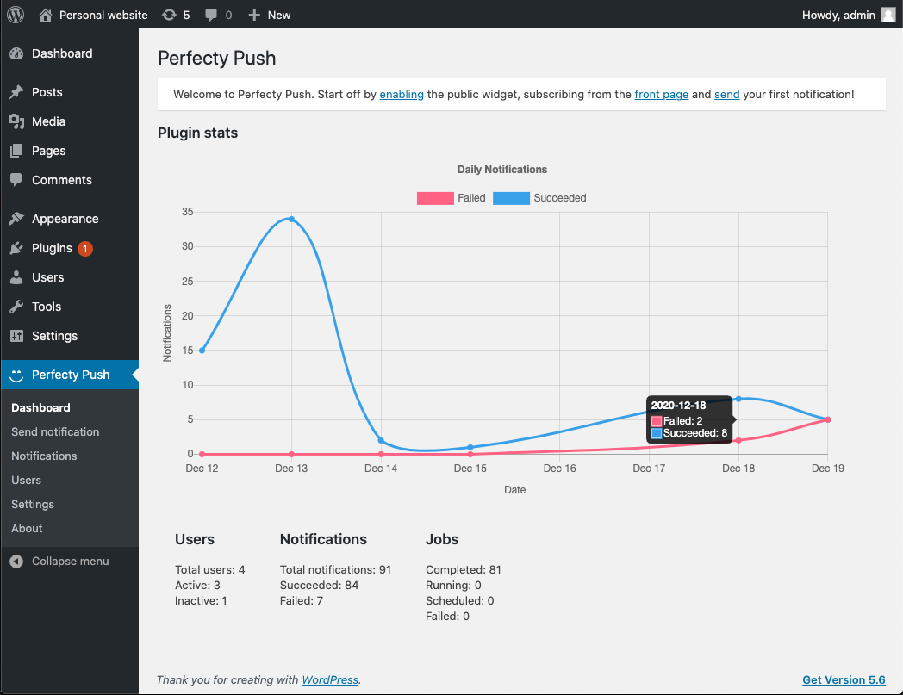
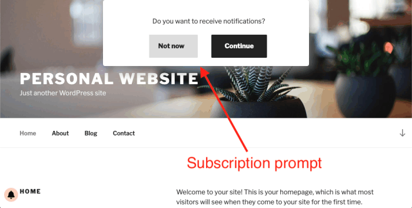

# Perfecty Push WP Plugin ⚡️

[](https://github.com/rwngallego/perfecty-push-wp/actions?query=workflow%3ATests)
[](https://github.com/rwngallego/perfecty-push-wp/actions?query=workflow%3ADeployment)
[](./LICENSE.txt)
[](https://plugintests.com/plugins/wporg/perfecty-push-notifications/latest)
[](https://plugintests.com/plugins/wporg/perfecty-push-notifications/latest)

Self-hosted Push Notifications from your Wordpress server for free! 🥳



**Perfecty Push WP** is an Open Source plugin for WordPress
that allows you to send web Push Notifications directly from your server:
No hidden fees, no third-party dependencies and you own your data. 👏

**Install it now:**
[https://wordpress.org/plugins/perfecty-push-notifications/](https://wordpress.org/plugins/perfecty-push-notifications/)

**More information about the project:** [https://perfecty.org/](https://perfecty.org/)

## Features ✨

- **Open Source**, send Push Notifications **from your server for free!**
- No third-party dependencies
- Migrate users from other push services like OneSignal
- Send push notifications on posts publishing
- Customize the public widget
- The user authorization tokens stay in your server
- Offline browser notifications through [Push API](https://developer.mozilla.org/en-US/docs/Web/API/Push_API) (Safari is not supported yet)
- Built-in Push Server based on [web-push-php](https://github.com/web-push-libs/web-push-php)

## Requirements 🧩

- `PHP >= 7.2`
- `gmp` extension for message encryption (optional)

**Note**: The `gmp` extension is optional and recommended
for better performance.

## Local development 👨🏻‍💻

To see it in action in your local development environment, you need a set of
services which Wordpress relies on. You start off by creating the docker image:

```
docker build -t custom-wordpress:beta-5.7-php7.3-apache .
```

Then start all the services and run the setup:

```
make up
make setup
```

You can now go to http://localhost/wp-login.php > Plugins > Activate the
**Perfecty Push** plugin.

## Available commands 👾

```
# start the service containers
make up

# stop de service containers
make down

# remote console
make console

# run the unit tests
make test

# run the formatter
make format

# setup all: make wordpress, make composer, make phpunit
make setup

# setup wordpress and plugins
make wordpress

# install all the composer dependencies
make deps

# setup wordpress as a testing environment for phpunit
make phpunit

# generates the redistributable bundle in dist/perfecty-push-notifications.zip
make bundle
```
## Demo 🎭

### Admin Dashboard



### Public view




## Testing ✅

This project relies on automated tests as in the [Wordpress Core](https://make.wordpress.org/core/handbook/testing/automated-testing/writing-phpunit-tests/) guidelines.

Run all the test suites:

```
make test
```

Run a single test:

```
make console
cd wp-contents/plugins/perfecty-push/
phpunit --filter test_schedule_broadcast_async
```

## Troubleshooting

**Not intended for production:** In case the plugins cannot be installed on your local installation do:

```
make console
chown -R www-data wp-content
```

## License 👓

The WordPress Plugin is an Open Source project licensed under [GPL v2](./LICENSE.txt).

The bell icon is a Font Awesome icon, a [CC BY 4.0 License](https://creativecommons.org/licenses/by/4.0/).

<span>Banner photo by <a href="https://unsplash.com/@nasa?utm_source=unsplash&amp;utm_medium=referral&amp;utm_content=creditCopyText">NASA</a> on <a href="https://unsplash.com/s/photos/world?utm_source=unsplash&amp;utm_medium=referral&amp;utm_content=creditCopyText">Unsplash</a></span>

## Contributing

If you're interesting on contributing to this project, feel free to submit your
suggestions as a PR or an issue directly to any of the projects repos.
Remember to read the [Code of Conduct](./CONDUCT) and the license information
of each project, which in general use the MIT license, except the WordPress plugin (GPL v2).

## Collaborators 🔥

[](https://github.com/rwngallego) | [](https://github.com/MocioF) |
:---: | :---: |
[Rowinson Gallego](https://github.com/rwngallego) | [MocioF](https://github.com/MocioF) |

## Special Thanks

[](https://www.jetbrains.com/?from=PerfectyPush)

Thanks to Jetbrains for supporting this Open Source project with their magnificent tools.